# Workout Log Application

## INTRODUCTION

This is my first server based application! I am building as a part of Eleven Fifty Academy's Web Development course.

## ENDPOINT TESTING

### user/register POST request

- **Register a new user**
  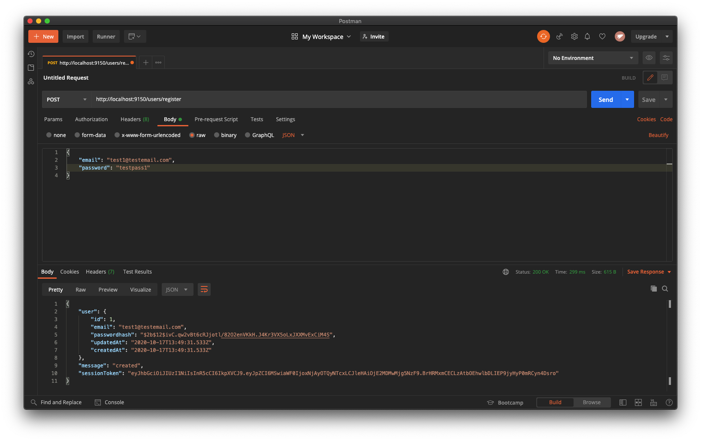
  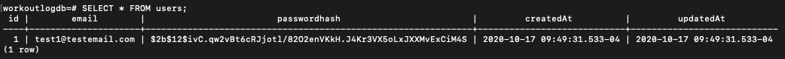

### user/login POST request

- **Successful Login**
  

- **Incorrect Password**
  

- **Incorrect Email Address**
  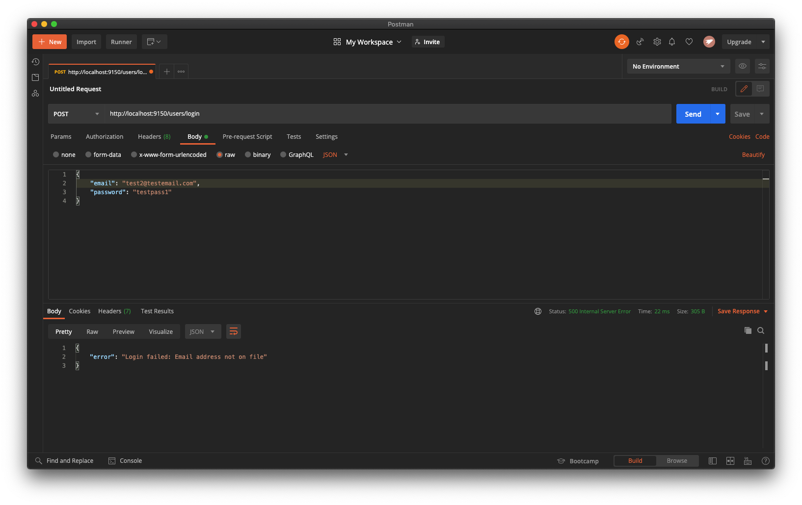

### log/ POST request

- **Create a log entry for a logged in user**
  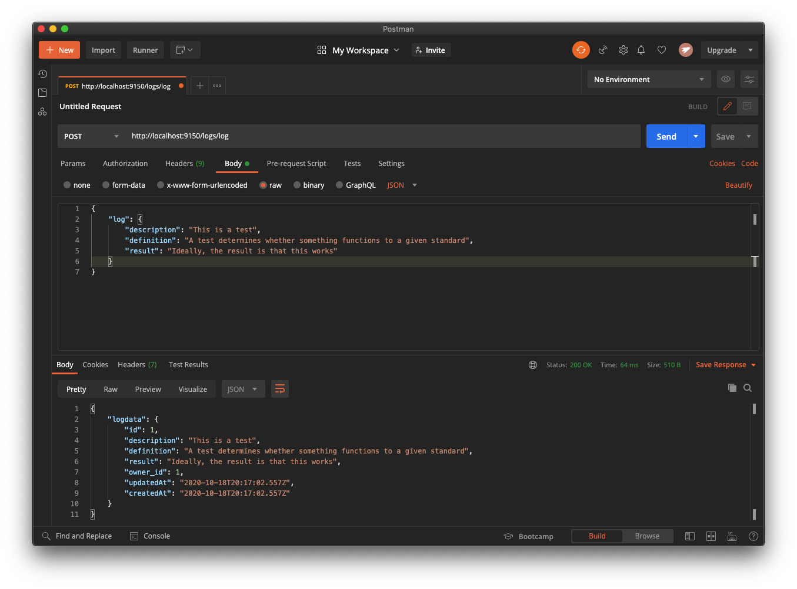
  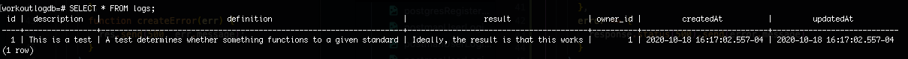

### log/ GET request

- **Get all logs for a logged in user**
  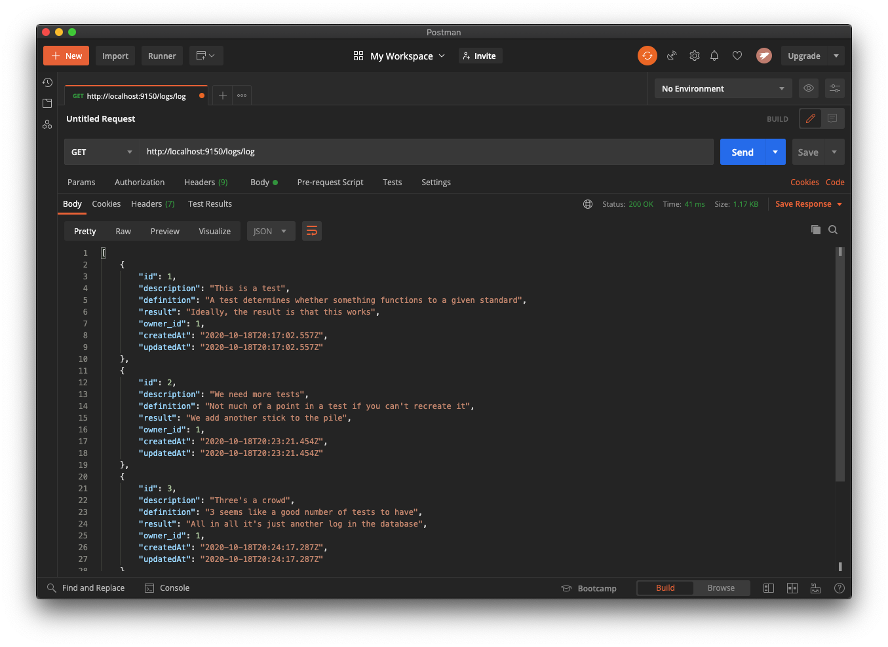

### log/:id GET request

- **Get a single log for a signed in user**
  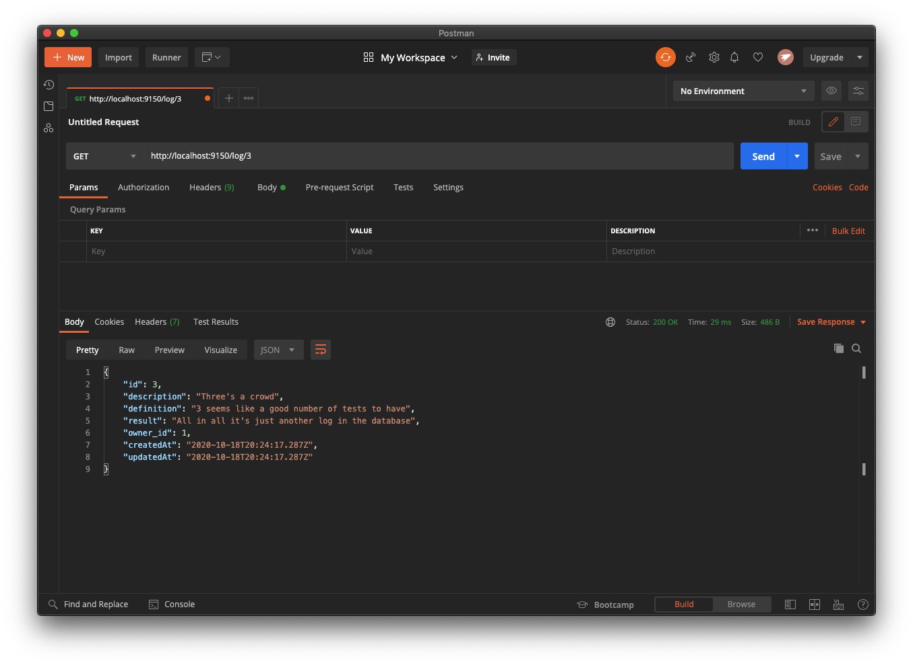

### log/:id PUT request

- **Update a specified log for a logged in user**
  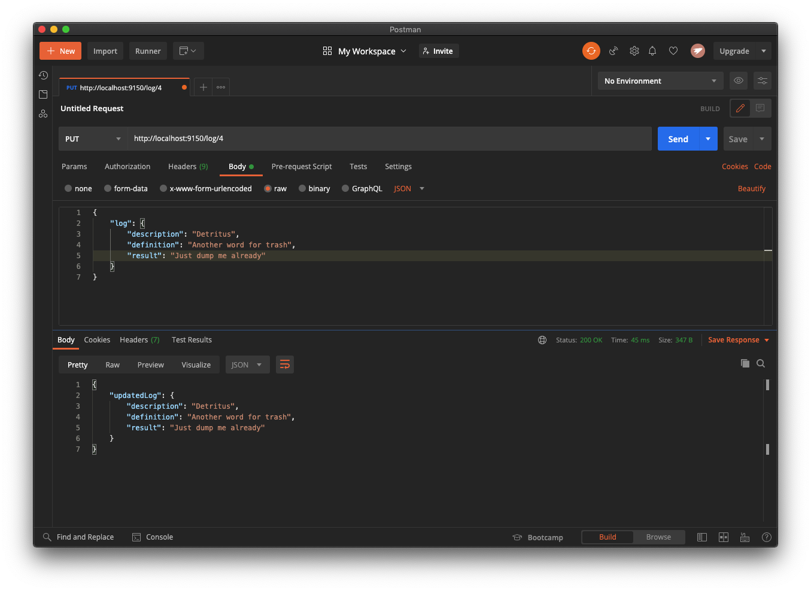

  - _Before updating table_
    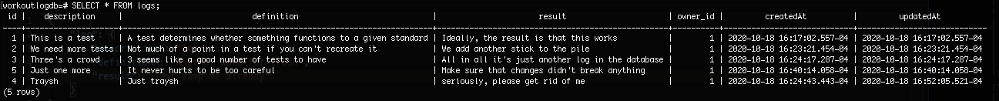
  - _After updating table_
    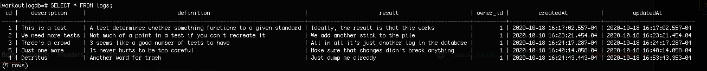

### log/:id DELETE request

- **Delete a specified log for a logged in user**
  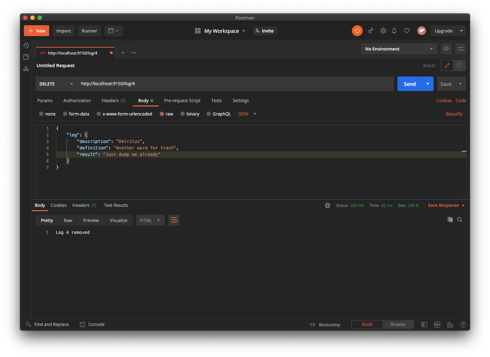
  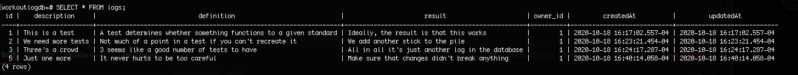
